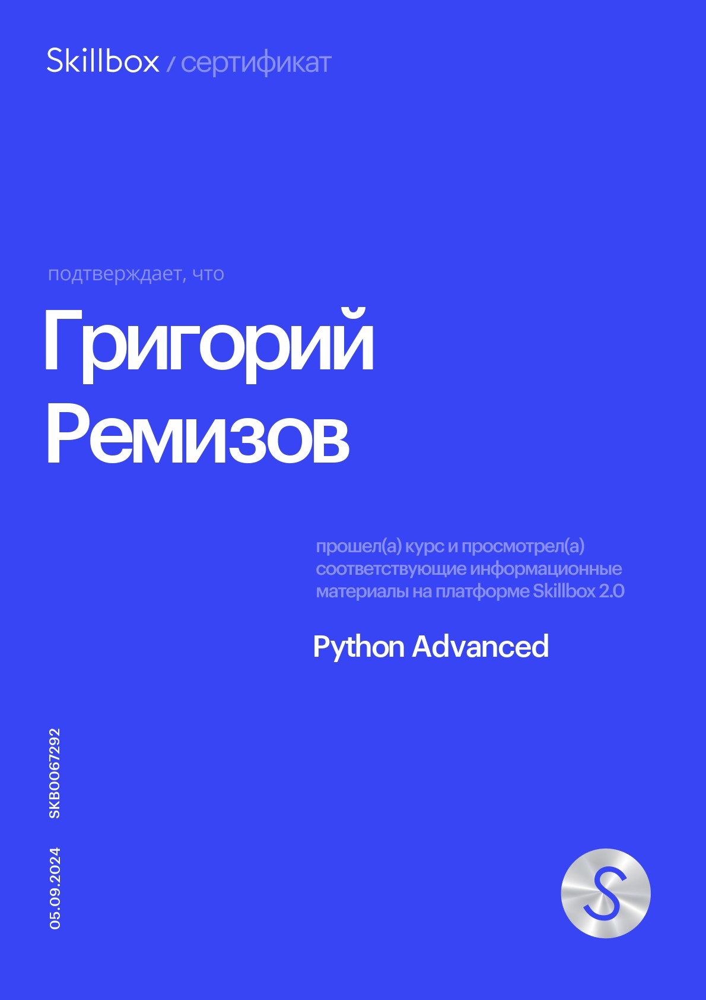

# Григорий Ремизов

### Мои контакты
 * **Почта:** *griy_rerere.contact@icloud.com*
 * **Телеграм:** *@griy_rerere*

### Обо мне
Студент 1 курса СПбГУ, факультет Прикладной математики-Процессов управления. Закончил курс skillbox по разработке на Python. Основная специалиазация - разработка серверных приложений. Мой основной приоритет - развитие себя в области математики и/или информатики. В будущем вижу себя учёным в этих областях.

**Мои сильные стороны:**
 * Ответственность
 * Стрессоустоичивоть
 * Коммуникабельность
 * Обучаемость

**Мой Гитхаб**

*https://github.com/Griy-dot-py*
*(На данный момент потерял к нему доступ)*

### Навыки
 * ***Git***
 * ***Python***
 * ***Flask***
 * ***FastAPI***
 * ***SQL***
 * ***Postgres***
 * ***ORM***
 * ***Redis***
 * ***REST API***
 * ***Docker***
 * ***Linux***
 * ***System design***
 * ***Clean architecture***

### Языки
 * **Русский** (родной)
 * **Английский (B1~B2)**
 * **Японский (N5~N4)**

### Навыки
 * ***Git***
 * ***Python***
 * ***Flask***
 * ***FastAPI***
 * ***SQL***
 * ***Postgres***
 * ***ORM***
 * ***Redis***
 * ***REST API***
 * ***Docker***
 * ***Linux***
 * ***System design***
 * ***Clean architecture***

### Языки
 * **Русский** (родной)
 * **Английский (B1~B2)**
 * **Японский (N5~N4)**

### Сетификат об окончании курсов

